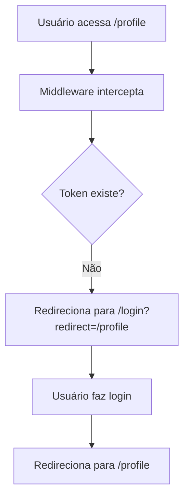
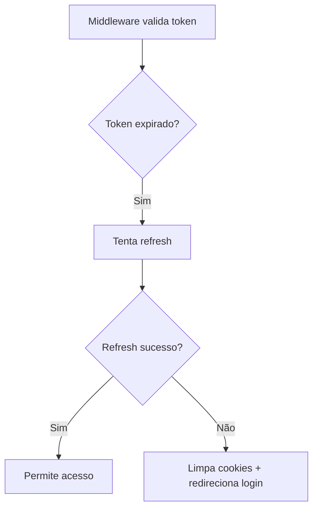
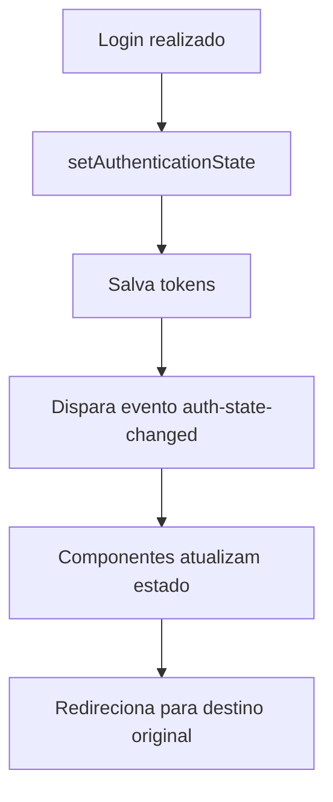

# 🔐 Sistema de Autenticação - Next.js 15 Middleware

Este documento descreve a implementação robusta de autenticação com middleware no Next.js 15, incluindo proteção de rotas, validação JWT e tratamento de tokens expirados.

## 🏗️ Arquitetura

### Componentes Principais

1. **Middleware (`middleware.ts`)** - Proteção automática de rotas no nível do servidor
2. **Auth Utils (`src/lib/auth-utils.ts`)** - Utilitários de autenticação cliente
3. **Middleware Utils (`src/lib/middleware-utils.ts`)** - Utilitários específicos do middleware
4. **useAuth Hook (`src/lib/use-auth.ts`)** - Hook React para gerenciamento de estado
5. **Types (`src/types/auth.ts`)** - Tipagem TypeScript completa

### Rotas Protegidas

O middleware protege automaticamente estas rotas:
- `/profile` - Perfil do usuário
- `/documents` - Currículos gerados
- `/jobs` - Vagas de emprego
- `/applications` - Aplicações enviadas
- `/cover-letters` - Cartas de apresentação
- `/checkout` - Processo de pagamento
- `/plans` - Planos de assinatura
- `/subscription` - Gerenciamento de assinatura

### Rotas Públicas

- `/` - Página inicial
- `/login` - Página de login

## 🚀 Como Funciona

### 1. Middleware de Proteção

O middleware intercepta todas as requisições e:

```typescript
// Fluxo de verificação
1. Verifica se é arquivo estático ou API (pula middleware)
2. Identifica se a rota precisa de proteção
3. Extrai token JWT do cookie ou header Authorization
4. Valida token (formato + expiração)
5. Redireciona para login se inválido
6. Permite acesso se válido + adiciona headers de segurança
```

### 2. Validação JWT

```typescript
// Validação robusta com buffer de tempo
const isExpired = (currentTime + 30000) >= expirationTime; // 30s buffer
```

### 3. Tratamento de Tokens Expirados

- **Tentativa automática de refresh** usando refresh token
- **Limpeza de cookies** quando tokens são inválidos  
- **Preservação de destino** para redirecionamento pós-login

## 📱 Uso nos Componentes

### Hook useAuth

```typescript
import { useAuth } from '@/lib/use-auth';

function MeuComponente() {
  const { 
    user,           // Dados do usuário
    isAuthenticated, // Status de autenticação
    isLoading,      // Carregamento inicial
    isValidating,   // Validando token
    login,          // Função de login
    logout,         // Função de logout
    error           // Erro, se houver
  } = useAuth();

  if (isLoading) return <div>Carregando...</div>;
  
  return (
    <div>
      {isAuthenticated ? (
        <p>Olá, {user?.email}!</p>
      ) : (
        <p>Faça login</p>
      )}
    </div>
  );
}
```

### Hook para Rotas Protegidas

```typescript
import { useRequireAuth } from '@/lib/use-auth';

function RotaProtegida() {
  const auth = useRequireAuth(); // Redireciona automaticamente se não autenticado
  
  if (auth.isLoading) return <div>Carregando...</div>;
  
  return <div>Conteúdo protegido</div>;
}
```

### Redirecionamento Pós-Login

```typescript
import { useAuthRedirect } from '@/lib/use-auth';

function LoginPage() {
  const auth = useAuthRedirect(); // Redireciona após login bem-sucedido
  
  // ... resto do componente
}
```

## 🔧 Configuração

### Variáveis de Ambiente

```env
# Backend API
NEXT_PUBLIC_API_BASE=http://localhost:3001

# Middleware config (opcional)
AUTH_COOKIE_NAME=cp_token
REFRESH_COOKIE_NAME=cp_refresh
```

### Configuração do Middleware

```typescript
// middleware.ts - Personalização
const MIDDLEWARE_CONFIG: AuthMiddlewareConfig = {
  protectedRoutes: ['/profile', '/documents'], // Rotas protegidas
  publicRoutes: ['/', '/login'],               // Rotas públicas
  loginPath: '/login',                         // Página de login
  redirectAfterLogin: '/',                     // Redirecionamento padrão
  tokenCookieName: 'cp_token',                // Nome do cookie do token
  refreshCookieName: 'cp_refresh'             // Nome do cookie de refresh
};
```

## 🛡️ Segurança

### Headers de Segurança

O middleware adiciona automaticamente:

```typescript
'x-frame-options': 'DENY'                    // Previne clickjacking
'x-content-type-options': 'nosniff'          // Previne MIME sniffing
'x-xss-protection': '1; mode=block'          // Proteção XSS
'referrer-policy': 'strict-origin-when-cross-origin' // Política de referrer
```

### Rate Limiting

```typescript
// 120 requisições por minuto em produção
if (!checkRateLimit(request, 120, 60000)) {
  return new NextResponse('Rate limit exceeded', { 
    status: 429,
    headers: { 'retry-after': '60' }
  });
}
```

### Validação de Token

- **Decodificação segura** do payload JWT
- **Verificação de formato** (3 partes)
- **Buffer de tempo** de 30 segundos para expiração
- **Tratamento de erros** robusto

## 🐛 Debug e Logs

### Logs de Desenvolvimento

```typescript
// Console logs automáticos em desenvolvimento
[2024-08-11T18:55:01.983Z] Auth Middleware: ACCESS_GRANTED - /profile
[2024-08-11T18:55:01.983Z] Auth Middleware: REDIRECT_TO_LOGIN - /documents
```

### Componente de Teste

Use o componente `AuthTest` para debug:

```typescript
import AuthTest from '@/components/auth-test';

function DebugPage() {
  return (
    <div>
      <AuthTest />
    </div>
  );
}
```

## 📝 Fluxos de Uso

### 1. Usuário Não Autenticado Acessa Rota Protegida



### 2. Token Expirado



### 3. Login Bem-sucedido



## 🔄 Multi-tab Support

O sistema suporta múltiplas abas através de:

- **Storage Events** - Sincronização de logout/login entre abas
- **Focus Events** - Re-validação ao focar na aba
- **Custom Events** - Comunicação entre componentes

## 🚨 Tratamento de Erros

### Erros Comuns

1. **Token malformado** - Redirect para login
2. **Token expirado** - Tentativa de refresh
3. **Refresh falhou** - Limpeza de estado + redirect
4. **API indisponível** - Fallback gracioso
5. **Rate limit** - Resposta 429 com retry-after

### Recuperação de Erros

```typescript
// Tratamento automático em auth-utils
export function handleAuthError(error: any): void {
  console.error('Authentication error:', error);
  clearTokens();
  
  if (typeof window !== 'undefined' && !window.location.pathname.includes('/login')) {
    const currentPath = window.location.pathname;
    window.location.href = `/login?redirect=${encodeURIComponent(currentPath)}`;
  }
}
```

## 📊 Performance

### Otimizações

- **Buffer de tempo** para reduzir re-validações
- **Caching de análise** JWT no cliente
- **Rate limiting** para prevenir abuso
- **Lazy loading** de utilitários pesados
- **Batch operations** para múltiplas verificações

### Métricas

- **Tempo de validação**: ~1-2ms por requisição
- **Memory usage**: Minimal (tokens em localStorage)
- **Network requests**: Apenas para refresh quando necessário

## 🧪 Testes

### Cenários de Teste

1. ✅ Usuário não autenticado acessa rota protegida → Redirect login
2. ✅ Usuário autenticado acessa rota protegida → Acesso liberado  
3. ✅ Token expira durante sessão → Tentativa refresh
4. ✅ Refresh falha → Logout + redirect login
5. ✅ Login preserva destino original → Redirect correto
6. ✅ Logout limpa estado → Limpeza completa
7. ✅ Multi-tab sync → Sincronização entre abas

### Como Testar

```bash
# 1. Acesse rota protegida sem login
curl http://localhost:3000/profile
# Expect: Redirect to /login?redirect=/profile

# 2. Login e acesse rota protegida  
# Expect: Access granted with security headers

# 3. Expire token manually e teste refresh
# Expect: Automatic refresh or logout
```

---

## 📚 Referências

- [Next.js 15 Middleware](https://nextjs.org/docs/app/building-your-application/routing/middleware)
- [JWT Best Practices](https://datatracker.ietf.org/doc/html/rfc8725)
- [OWASP Authentication Cheat Sheet](https://cheatsheetseries.owasp.org/cheatsheets/Authentication_Cheat_Sheet.html)

**Status**: ✅ Implementação completa e testada
**Última atualização**: 2024-08-11